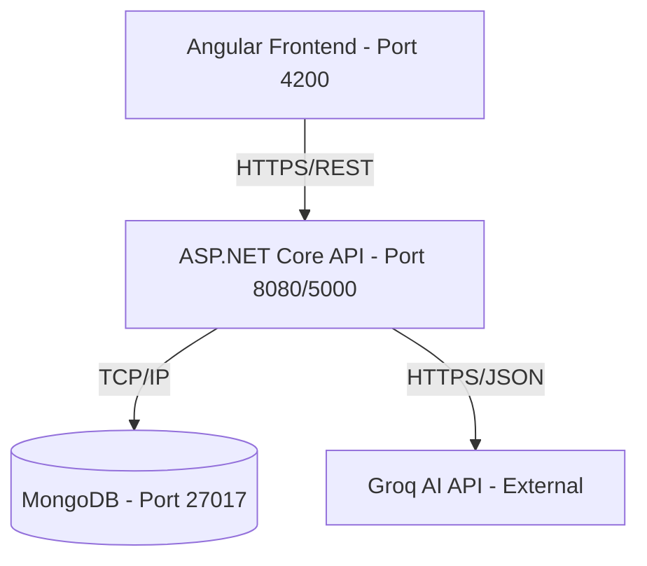
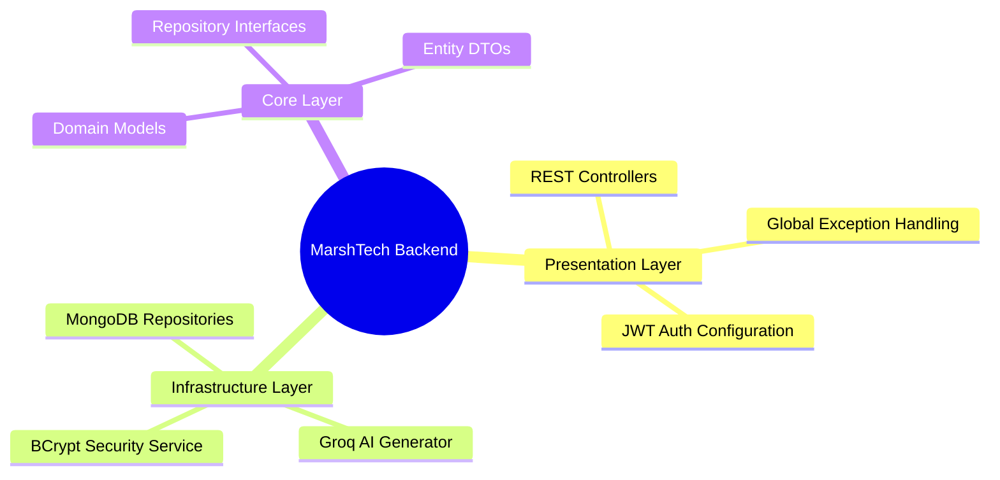
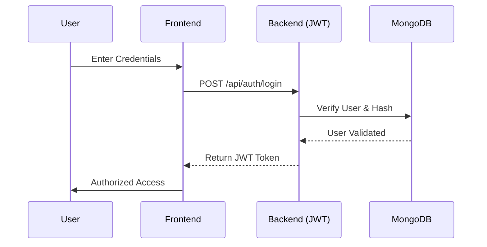

# MarshTech Device Management System

## Overview
The MarshTech Device Management System (Darwin) is a professional solution designed for comprehensive tracking and management of corporate hardware assets. Built with a focus on scalability, security, and user experience, the system provides real-time visibility into device specifications, physical locations, and personnel assignments.

The application leverages a modern technology stack and adheres to Clean Architecture principles to ensure long-term maintainability and robust performance.

## Key Features

### 1. Advanced Algorithmic Search (Levenshtein Fuzzy Search)
The system implements a custom search engine that utilizes the Levenshtein Distance algorithm. This provides a typo-tolerant, case-insensitive search experience. Unlike standard database queries, this implementation normalizes inputs and calculates similarity scores across multiple fields (Name, Manufacturer, Type, Processor), ensuring that the most relevant results are surfaced even with imperfect user input.

### 2. AI-Powered Technical Descriptions (Groq LLM)
Integration with the Groq API (Llama-based models) allows the system to automatically generate human-readable, professional technical descriptions for any device. By analyzing raw specifications like RAM, Processor, and OS, the AI agent provides concise summaries that assist warehouse operators and hardware specialists in identifying equipment roles.

### 3. Role-Based Access Control (RBAC)
Security is managed through a robust JWT-based authentication system. The application enforces role-based permissions, allowing organizations to define specific access levels:
- Hardware Specialist
- Project Manager
- Warehouse Operator
- Developer / QA

### 4. Interactive API Documentation
Full OpenAPI/Swagger integration provides a self-documenting interface for developers to test and explore the API endpoints in real-time.

---

## Technical Architecture

### System Orchestration
The following diagram illustrates the containerized environment and the communication flow between the different layers of the infrastructure.



### Clean Architecture Layers
The project follows a decoupling strategy where the logic is organized into three distinct layers, each with a single responsibility.

| Layer | Responsibility | Components |
| :--- | :--- | :--- |
| **Presentation** | Entry points, request handling, and API security | `DeviceManager.API` |
| **Infrastructure** | Database persistence, external AI clients, and Auth services | `DeviceManager.Infrastructure` |
| **Core (Domain)** | Business entities, validation rules, and logic interfaces | `DeviceManager.Core` |



### Authentication Flow
The security handshake between the client and the identity provider.



---

## Technology Stack

- **Backend**: .NET 9 (C#), ASP.NET Web API
- **Frontend**: Angular 18+, TailwindCSS, Angular Material
- **Database**: MongoDB (NoSQL)
- **Security**: JWT (Json Web Tokens), BCrypt.Net-Next (Password Hashing)
- **AI**: Groq API (Llama 3.1)
- **Containerization**: Docker, Docker Compose
- **Testing**: xUnit, Integration Tests

---

## Getting Started

### Authentication and Role-Based Access

The system manages security through an integrated JWT (JSON Web Token) authentication service. Each user is assigned a specific role that dictates their permissions within the platform.

### Standard Test Credentials
The database is automatically seeded with several test accounts. You can use any of the follows to explore the system's role-based behavior:

| Role | Email | Password | Permissions |
| :--- | :--- | :--- | :--- |
| **Hardware Specialist** | `hardware@test.com` | `test123!` | Full CRUD access: Create, Read, Update, Delete devices. |
| **Developer** | `dev@test.com` | `test123!` | Limited access: Read devices and assign them to self. |

### Technical Implementation
Authentication is handled via the `/api/auth/login` endpoint, which returns a Bearer token. This token must be included in the Authorization header of all protected requests. The frontend maintains this state using an Angular AuthInterceptor.

## Prerequisites
- Docker Desktop
- .NET 9 SDK (for manual execution)
- Node.js 18+ (for manual execution)

### Installation via Docker (Recommended)

1. Clone the repository.
2. In the root directory, create a `.env` file (referencing `.env.example` if available) and add your `GROQ_API_KEY`.
3. Execute the following command:
```bash
docker-compose up -d --build
```
4. Access the application:
- **Frontend App**: http://localhost:4200
- **Backend API**: http://localhost:5000
- **Swagger Documentation**: http://localhost:5000/swagger

### Method 2: Manual Setup

#### 1. Backend Setup
1. Ensure MongoDB is running on `localhost:27017`.
2. Execute the following commands:
```bash
cd backend
dotnet restore
dotnet run --project DeviceManager.API
```
3. The API will be available at:
- **HTTP**: http://localhost:5041
- **HTTPS**: https://localhost:7229
- **Swagger UI**: http://localhost:5041/swagger

#### 2. Frontend Setup
```bash
cd frontend
npm install
npm start
```
4. Access the UI at: http://localhost:4200

---

## API Documentation (Swagger)

The application includes a comprehensive Swagger UI for API exploration. Once the backend is running, navigate to `http://localhost:5000/swagger`.

### Key Endpoints
- **POST /api/auth/login**: Authenticate user and receive access token.
- **GET /api/devices**: Retrieve all devices (supports advanced fuzzy search).
- **POST /api/devices/generate-description**: Invoke AI to generate device specifications summary.
- **PUT /api/devices/{id}/assign**: Assign a device to a specific user.

---

## Project Structure

```text
MarshTech/
├── backend/
│   ├── DeviceManager.API/            # Controllers and Middleware
│   ├── DeviceManager.Core/           # Domain Models and Interfaces
│   ├── DeviceManager.Infrastructure/ # Data Persistence and Services
│   └── DeviceManager.Tests/          # Integration Testing Suite
├── frontend/
│   ├── src/app/components/           # UI Components
│   └── src/app/services/             # API Consumption Logic
├── scripts/                          # Database Initialization Scripts
├── docker-compose.yml                # Orchestration Configuration
└── README.md                         # Project Documentation
```

## Development Phases
1. **Foundation**: API boilerplate, MongoDB integration, and Clean Architecture setup.
2. **Core Logic**: Implementation of CRUD and Repository patterns.
3. **Security**: Integration of JWT Authentication and RBAC.
4. **AI & Algorithm**: Implementation of Groq AI Service and Levenshtein Fuzzy Search.
5. **UI/UX**: Development of the Angular dashboard and responsive components.

---
